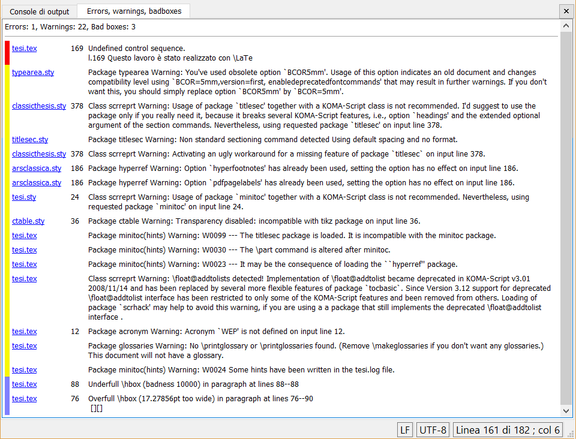

LaTeX Log Parser for TeXworks
=============================

This is currently the official TeXworks plugin that handles LaTeX compilation log, detecting errors, warnings and bad boxes.

Installation instructions
=========================

Since the script is already bundled with TeXworks, there is no need to install it by hand.

If you want to update your bundled version and use the latest Log Parser, follow the these istructions:

1. Open TeXworks.
2. Go to menu _Scripts_  → _Scripting TeXworks_.
3. Select _Show Scripts Folder_: it will open a new window showing the folder in which all scripts reside.
4. Go in the _Hooks_ subfolder.
5. Download [logParser.js](logParser.js?raw=true) and place it in the _Hooks_ folder.

The script should be executed automatically at the end of each compilation.

Reporting issues
================

Please report any issue using the issue tracker.
